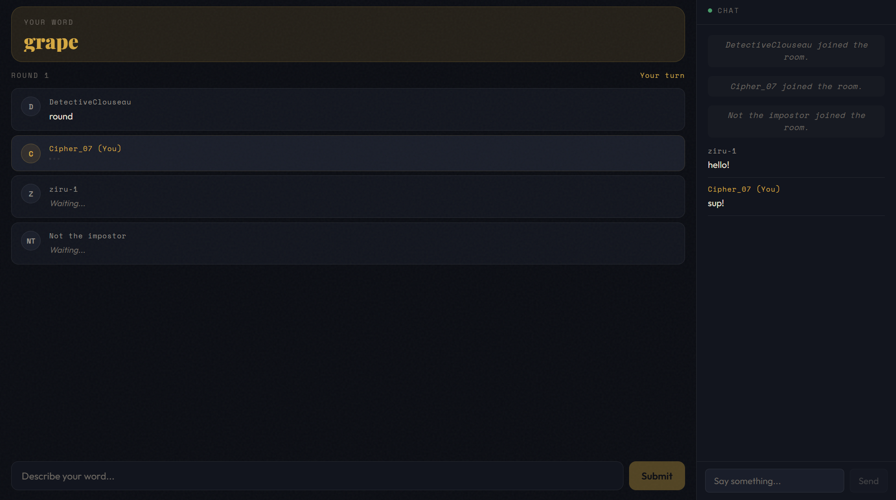
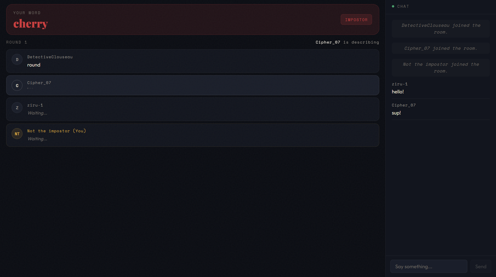
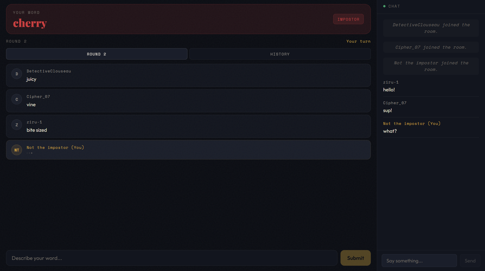
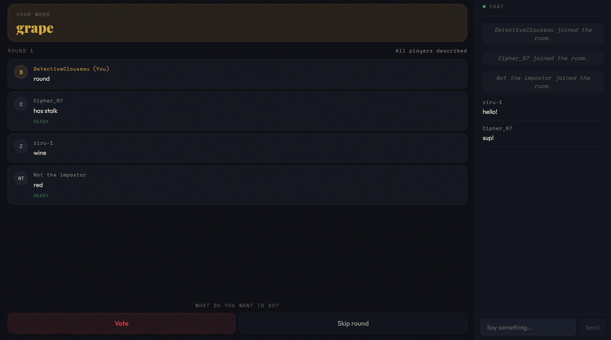
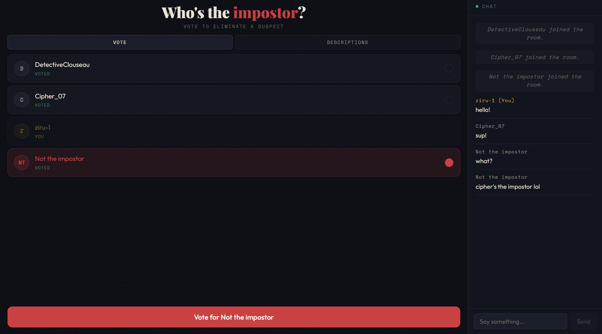
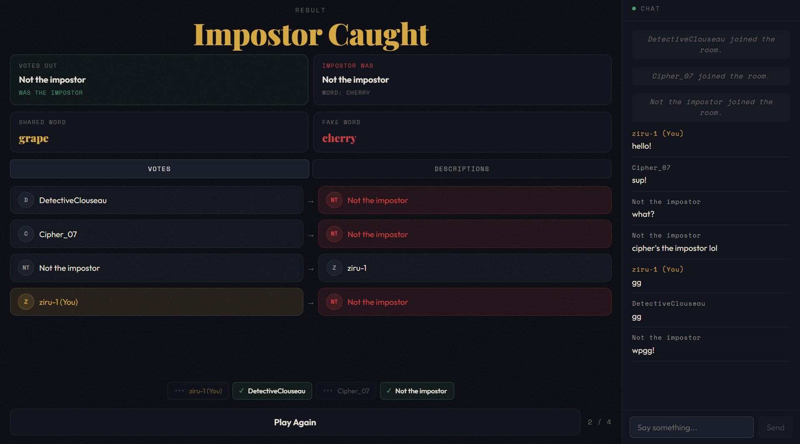
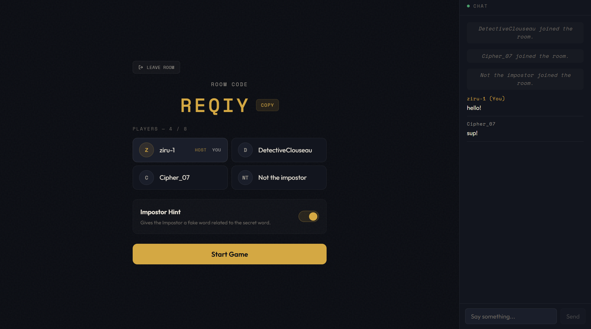

# Word Impostor Game

A real-time multiplayer social deduction game. Players receive a secret word and must describe it without giving it away - but one player, the Impostor, has a different word and must blend in.

🔗 **[Live Demo](https://word-impostor-game.vercel.app/)**


---

## How It Works

1. **Get your word** - Everyone receives the same secret word, except the Impostor who gets a similar but different word (or no hint at all in hard mode).

2. **Describe your word** - Players take turns giving a one-sentence clue. Be descriptive enough to prove you know it, but vague enough not to give it away.

   
   
   

3. **Vote to proceed** - After everyone describes, the group votes to start a new round or move to elimination.

   

4. **Eliminate a suspect** - Everyone votes for who they think the Impostor is. Most votes gets eliminated.

   

5. **Find out the truth** - The Impostor wins if they survive. Everyone else wins if they correctly eliminate the Impostor.

   

---

## Features

- Real-time multiplayer using WebSockets (Socket.IO)
- Turn-based description system with randomized player order
- Voting system with tie-breaking
- Persistent in-room chat across all game stages
- Game reveal screen showing the impostor, shared word, and fake word
- Hard mode - Impostor receives no hint word
- Play again without leaving the room
- Responsive layout (desktop and mobile)



---

## Tech Stack

| Layer        | Technology                                        |
| ------------ | ------------------------------------------------- |
| Frontend     | React, TypeScript, Vite                           |
| Backend      | Node.js, Express, Socket.IO                       |
| Shared Types | Custom monorepo types package (`@impostor/types`) |
| Monorepo     | npm workspaces                                    |
| Testing      | Vitest                                            |
| Deployment   | Vercel (client), Render (server)                  |

---

## Project Structure

```
word-impostor-game/
├── client/          # React + Vite frontend
├── server/          # Node.js + Express + Socket.IO backend
└── types/           # Shared TypeScript types (@impostor/types)
```

---

## Architecture

The server follows a strict separation of concerns:

- **`gameLogic.ts`** - Pure functions only. No side effects, no database calls. All game state transitions live here.
- **`roomManager.ts`** - Owns the in-memory room store (`Map<string, GameRoom>`). All read/write operations go through here.
- **`socketHandler.ts`** - Handles socket events, calls game logic, persists state via `roomManager`, and broadcasts updates.

All game state is sent to clients as `PublicGameRoom` - a stripped version that never exposes `sharedWord`, `fakeWord`, or `isImpostor`. Player-specific data (word, role) is emitted privately to each socket after the game starts.

---

## Getting Started

### Prerequisites

- Node.js 18+
- npm 8+

### Installation

```bash
git clone https://github.com/your-username/word-impostor-game.git
cd word-impostor-game
npm install
```

### Environment Variables

Create `server/.env`:

```
CLIENT_URL=http://localhost:5173
```

Create `client/.env`:

```
VITE_SERVER_URL=http://localhost:3001
```

### Running Locally

In one terminal:

```bash
cd server
npm run dev
```

In another terminal:

```bash
cd client
npm run dev
```

Then open [http://localhost:5173](http://localhost:5173).

### Running Tests

```bash
cd server
npm run test
```

---

## Testing

The server has 53+ unit tests across 11 test files covering all game logic functions:

- `createRoom` - room creation and initial state
- `joinRoom` - player joining and room capacity
- `startGame` - word assignment, impostor selection, Fisher-Yates shuffle
- `submitDescription` - turn order, validation, phase tracking
- `checkDescriptionPhaseEnd` - round advancement and auto-transition on round 3
- `submitRoundDecision` - majority vote tallying
- `castVote` - vote counting and tie-breaking
- `submitPlayAgain` - lobby reset flow
- `sendMessage` - chat validation
- `removePlayerFromRoom` - host reassignment
- `toPublicGameRoom` - sensitive field stripping

---

## License

MIT
